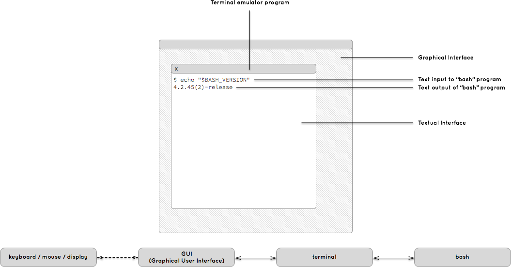

# BASH - An introduction (or quick refresher)

## Week 1, Part 1

---

## Resources

For this week, I have used the [Bash Guide](https://mywiki.wooledge.org/FullBashGuide) extensively.  
Since this is a quick introduction, we won't dive deeper into BASH scripting.  

However, I strongly encourage you to explore the full Bash Guide if that interests you.  
It also serves as a handy cheat sheet and resource for BASH commands.

---

## Are You on macOS or Use a MacBook?

The terminal application on macOS looks and operates slightly differently compared to Windows.  

- **macOS**: The Terminal uses Unix-based shells (POSIX standards) similar to Linux.  
- **Windows**: Default terminals are CMD and PowerShell, which use different command syntax and are not Unix-based.  

On macOS, the default shell is **zsh (z shell)**.  
You will need to switch to **bash** for this week.

---

### Switching to Bash on macOS

To switch to `bash` temporarily:  
```shell
exec bash
```

To switch back to `zsh`:  
```shell
exec zsh
```

For a permanent change, follow [this guide](https://stackoverflow.com/questions/77052638/changing-default-shell-from-zsh-to-bash-on-macos-catalina-and-beyond).  
However, keeping your terminal on zsh may be better.

---

## What is Bash?

**BASH** stands for **Bourne Again Shell**.  
It is based on the Bourne shell and is mostly compatible with its features. It is an application you run to give commands to your computer, either interactively at a prompt or by executing scripts.

---

## What is a Shell?

Shells are **command interpreters**.  
They allow users to:  
- Interact with the operating system.  
- Execute batches of commands quickly.  

Shells are not required for program execution but act as a layer between system function calls and the user.

---

## What Do I Do With Bash?

Most of you are already comfortable using computers through a graphical user interface (GUI)—clicking buttons, dragging windows, and typing into text fields. This visual approach is how most people interact with their systems.

Bash, however, offers a different way: it operates in a text-only console, where you interact by typing commands and reading text output. If you’re new to this environment, it may feel unfamiliar or even limiting at first.

In reality, the simplicity of a text-based interface is a strength. It provides a consistent structure for issuing commands and interpreting results. Skilled users can perform tasks far more efficiently in a shell than through a GUI. Bash’s straightforward language is a key part of this efficiency.

So, what can you do with Bash? You’ll use it to explore files on your computer, examine their contents, and run programs that can edit, convert, or organize your data. Bash lets you move and copy files, automate backups, download and compile code, and much more. 

Remember: Bash is just one tool among many on your system. Mastering Bash will help you use other tools more effectively, but learning the broader toolbox takes time and practice. Focus on building a solid foundation—don’t rush, and avoid costly mistakes!


---

## What Bash is NOT

BASH is **not**:  
- Your operating system.  
- Your window manager.  
- Your terminal (though it runs inside your terminal).  
- Responsible for mouse/keyboard control, screensavers, or file opening.  

It is simply an **interface** for executing statements using BASH syntax.

---

### Using Bash

Most users that think of BASH think of it as a prompt and a command line. That is BASH in interactive mode. BASH can also run in non-interactive mode, as when executing scripts. We can use scripts to automate certain logic. Scripts are basically lists of commands (just like the ones you can type on the command line), but stored in a file. When a script is executed, all these commands are (generally) executed sequentially, one after another.

For this course, we will stick to BASH in interactive mode. 

---
### Using Bash

> First, we should make sure we are running a bash shell. In your CLI (commmand line interface) type `echo "$BASH_VERSION"` and press enter to run the command. You should see an output such as `4.2.45(2)-release` or so. If not, you are not running a bash shell. 

**Important!**
You should make yourself familiar with the man and apropos commands on the shell. They will be vital to your learning.

```shell
$ man man
```

In this code, the `$` at the beginning of a line represents your BASH prompt. Your actual BASH prompt will probably be much longer than `$`. Prompts are often highly individualized.

---
### Using Bash - Visualising How Bash Functions


---

### Using Bash - `man`
- The `man` command stands for "manual"; it opens documentation on various topics. You use it by running the command `man [topic]` at the BASH prompt, where [topic] is the name of the "page" you wish to read. Note that many of these "pages" are considerably longer than one printed page; nevertheless, the name persists. 
- Each command (application) on your system is likely to have a `man` page. There are pages for other things too, such as system calls or specific configuration files. In this class, we will only be covering commands.

> Note that if you're looking for information on BASH built-ins (commands provided by BASH, not by external applications) you should look in man bash instead. BASH's manual is extensive and detailed. It is an excellent reference, albeit more technical than this guide.

---
### Using Bash - `help`
Bash also offers a help command which contains brief summaries of its built-in commands (which we'll discuss in depth later on).

```shell
$ help
$ help read
```

- Remember:
  - **TIP**: You can press the up arrow to cycle through previous commands
  - **TIP**: When using windows you can right-click to paster (instead of ctrl-v).

> IMPORTANT: CTRL-C (cmd-C) will cancel any command running, this will be useful if you accidentally try to open a large file
---
### Using BASH - Commands

As mentioned earlier, bash waits for instructions from you and then executes them to the best of its abilities. To get the most out of bash, and especially to avoid damage due to bash misunderstanding your intentions, it's important that you pay close attention to these basics of the bash shell language. There are many people that consider themselves fluent in bash but fail to understand even these most basic concepts. As a result, they create programs that can inflict extensive damage to unsuspecting users and systems. Don't be that person.

---
### Using BASH - Common Commands
<style>
table {
    font-size: 10pt;
}
</style>

| Command      | Description                                                                                   |
|--------------|----------------------------------------------------------------------------------------------|
| `ls`         | Show directory contents, lists names of files.                                                |
| `mkdir`      | Creates a directory of the specified name.                                                    |
| `cat`        | Display contents of a file.                                                                   |
| `cd`         | Change directory. Change to certain directory name if provided.                               |
| `pwd`        | Displays the name of the working directory.                                                   |
| `touch`      | Creates a blank file with a specified name.                                                   |
| `less`       | View contents of specified file, page by page.                                                |
| `head`/`tail`| Displays the first/last 10 lines of a file.                                                   |
| `rm`         | Removes a specified file. This action is permanent. There is no recycle bin.                  |
| `rmdir`      | Removes a directory.                                                                          |
| `history`    | Display a listing of the last commands you've run.                                            |
| `cp`         | Copy specified file to a new named file. Use `-r` flag to copy a directory.                   |
| `mv`         | Rename a specified file or directory.                                                         |
| `find`       | Search files and directories. Can use with wildcards (`*`, `?`, `[ ]`).                       |
| `curl`       | Download a webpage.                                                                           |
| `help`       | Get help on a command, e.g., `help ls`.                                                       |


---

## Paths & Navigation (Absolute vs Relative)

- **Absolute path**: starts at root `/` and never depends on “where you are”.
  - Example: `/Users/you/projects/bda`
- **Relative path**: starts from your **current directory**.
  - `.` = current folder, `..` = parent folder, `~` = home
  - Examples: `cd ..`, `cd ./notes`, `cd ~/Downloads`
- Quick moves:
  - `pwd` shows where you are; `cd -` toggles between last two locations
- Try: `mkdir -p ~/bda/week01 && cd ~/bda/week01 && pwd`

Source: BashGuide — Shell usage & basics (Intro 1.3).

---

## Creating, Copying, Renaming, Deleting

- Make/remove folders: `mkdir data`, `rmdir empty_folder`
- Make files: `touch names.txt` (also updates timestamp)
- Copy & move:
  - `cp source.txt backup.txt`
  - `cp -r src_dir/ dest_dir/` (recursive)
  - `mv report.txt report_old.txt` (rename or move)
- Delete **carefully**:
  - `rm file.txt` (permanent), `rm -r folder/` (recursive)

> Tip: use `ls -l` often to verify before destructive actions.

---
