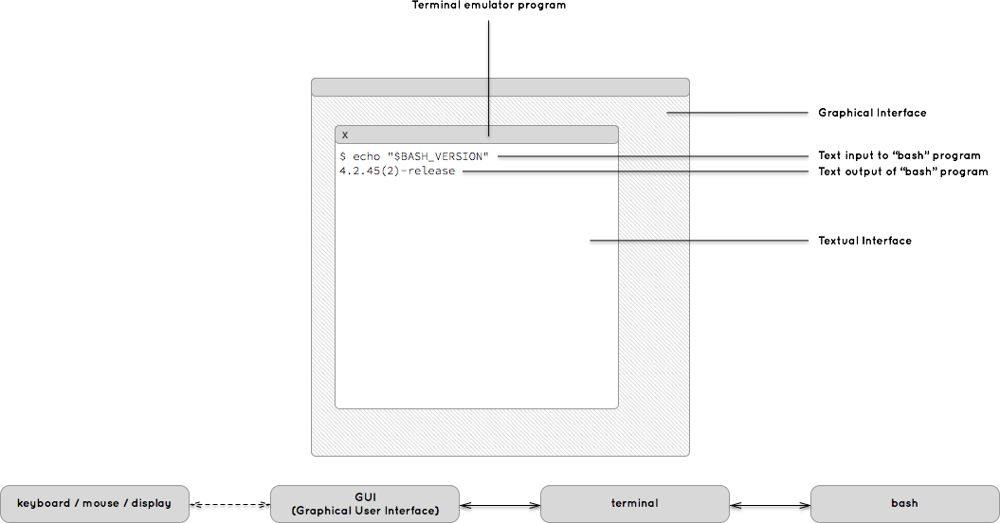

# BASH - An introduction (or quick refresher)


---

## Resources

For this week, I have used the [Bash Guide](https://mywiki.wooledge.org/FullBashGuide) extensively.  
Since this is a quick introduction, we won't dive deeper into BASH scripting.  

However, I strongly encourage you to explore the full Bash Guide if that interests you.  
It also serves as a handy cheat sheet and resource for BASH commands.

---

## Are You on macOS or Use a MacBook?

The terminal application on macOS looks and operates slightly differently compared to Windows.  

- **macOS**: The Terminal uses Unix-based shells (POSIX standards) similar to Linux.  
- **Windows**: Default terminals are CMD and PowerShell, which use different command syntax and are not Unix-based.  

On macOS, the default shell is **zsh (z shell)**.  
You will need to switch to **bash** for this week.

---

### Switching to Bash on macOS

To switch to `bash` temporarily:  
```shell
exec bash
```

To switch back to `zsh`:  
```shell
exec zsh
```

For a permanent change, follow [this guide](https://stackoverflow.com/questions/77052638/changing-default-shell-from-zsh-to-bash-on-macos-catalina-and-beyond).  
However, keeping your terminal on zsh may be better.

---

### Are you On Windows? 

- Windows does not support BASH natively through the powershell and terminal, and thus yoou need to install the Windows Subsystem for Linux. Fortunately, this can be done with a single line of code. 
- Open PowerShell in administrator mode by right-clicking and selecting "Run as administrator", enter the wsl --install command, then restart your machine.
```powershell
wsl --install
```
- Click Yes/Agree/Accept on any Windows pop-up.
---
### Are you On Windows? 
- Once installed, restart your machine, and open Ubuntu from the Start Menu. This gives you a full Bash shell, exactly like you'd have on a Linux machine.
- Otherwise you can run individual Bash commands from PowerShell or CMD using:
```bash
wsl ls -la
wsl echo "Hello from WSL"
```
- The `wsl` command passes the instruction to your default WSL distro and executes it in a Bash shell.
---

## What is Bash?

**BASH** stands for **Bourne Again Shell**.  
It is based on the Bourne shell and is mostly compatible with its features. It is an application you run to give commands to your computer, either interactively at a prompt or by executing scripts.

---

## What is a Shell?

Shells are **command interpreters**.  
They allow users to:  
- Interact with the operating system.  
- Execute batches of commands quickly.  

Shells are not required for program execution but act as a layer between system function calls and the user.

---

## What Do I Do With Bash?


Most of you are already comfortable using computers through a graphical user interface (GUI). 

Bash, however, offers a different way: it operates in a text-only console, where you interact by typing commands and reading text output.

In reality, the simplicity of a text-based interface is a strength. It provides a consistent structure for issuing commands and interpreting results. Skilled users can perform tasks far more efficiently in a shell than through a GUI. Bash’s straightforward language is a key part of this efficiency.


---

## What Do I Do With Bash?

So, what can you do with Bash? You’ll use it to explore files on your computer, examine their contents, and run programs that can edit, convert, or organize your data. Bash lets you move and copy files, automate backups, download and compile code, and much more. 

> Remember: Bash is just one tool among many on your system. Mastering Bash will help you use other tools more effectively, but learning the broader toolbox takes time and practice. Focus on building a solid foundation—don’t rush, and avoid costly mistakes!

---
## What Bash is NOT

BASH is **not**:  
- Your operating system.  
- Your window manager.  
- Your terminal (though it runs inside your terminal).  
- Responsible for mouse/keyboard control, screensavers, or file opening.  

It is simply an **interface** for executing statements using BASH syntax.

---

### Using Bash

Most users that think of BASH think of it as a prompt and a command line. That is BASH in interactive mode. BASH can also run in non-interactive mode, as when executing scripts. We can use scripts to automate certain logic. Scripts are basically lists of commands (just like the ones you can type on the command line), but stored in a file. When a script is executed, all these commands are (generally) executed sequentially, one after another.

For this course, we will stick to BASH in interactive mode. 

---
### Using Bash

> First, we should make sure we are running a bash shell. In your CLI (commmand line interface) type `echo "$BASH_VERSION"` and press enter to run the command. You should see an output such as `4.2.45(2)-release` or so. If not, you are not running a bash shell. 

**Important!**
You should make yourself familiar with the man and apropos commands on the shell. They will be vital to your learning.

```shell
$ man man
```

In this code, the `$` at the beginning of a line represents your BASH prompt. Your actual BASH prompt will probably be much longer than `$`. Prompts are often highly individualized.

---
### Using Bash - Visualising How Bash Functions


---

### Using Bash - `man`
- The `man` command stands for "manual"; it opens documentation on various topics. You use it by running the command `man [topic]` at the BASH prompt, where [topic] is the name of the "page" you wish to read. Note that many of these "pages" are considerably longer than one printed page; nevertheless, the name persists. 
- Each command (application) on your system is likely to have a `man` page. There are pages for other things too, such as system calls or specific configuration files. In this class, we will only be covering commands.

> Note that if you're looking for information on BASH built-ins (commands provided by BASH, not by external applications) you should look in man bash instead. BASH's manual is extensive and detailed. It is an excellent reference, albeit more technical than this guide.

---
### Using Bash - `help`
Bash also offers a help command which contains brief summaries of its built-in commands (which we'll discuss in depth later on).

```shell
$ help
$ help read
```

- Remember:
  - **TIP**: You can press the up arrow to cycle through previous commands
  - **TIP**: When using windows you can right-click to paster (instead of ctrl-v).

> IMPORTANT: CTRL-C (cmd-C) will cancel any command running, this will be useful if you accidentally try to open a large file.
---
### Using BASH - Commands

As mentioned earlier, bash waits for instructions from you and then executes them to the best of its abilities. To get the most out of bash, and especially to avoid damage due to bash misunderstanding your intentions, it's important that you pay close attention to these basics of the bash shell language. There are many people that consider themselves fluent in bash but fail to understand even these most basic concepts. As a result, they create programs that can inflict extensive damage to unsuspecting users and systems. Don't be that person.

---

### Using BASH - Commands

- At the core of the bash shell language are its commands. Your commands tell bash what you need it to do, step-by-step, command-by-command.
- Bash generally takes one command from you at a time, executes the command, and when completed returns to you for the next command. We call this synchronous command execution. It is important to understand that while bash is busy with a command that you give it, you cannot interact with bash directly: you'll have to wait for it to be ready with executing its command and return to the script. For most commands, you'll barely notice this: they get executed so fast bash will be back for the next command before you realize.
---
### Using BASH - Common Commands
<style>
table {
    font-size: 10pt;
}
</style>

|Command      | Description                                                                                   |
|--------------|----------------------------------------------------------------------------------------------|
| `ls`         | Show directory contents, lists names of files.                                                |
| `mkdir`      | Creates a directory of the specified name.                                                    |
| `cat`        | Display contents of a file.                                                                   |
| `cd`         | Change directory. Change to certain directory name if provided.                               |
| `pwd`        | Displays the name of the working directory.                                                   |
| `touch`      | Creates a blank file with a specified name.                                                   |
| `less`       | View contents of specified file, page by page.                                                |
| `head`/`tail`| Displays the first/last 10 lines of a file.                                                   |
| `rm`         | Removes a specified file. This action is permanent. There is no recycle bin.                  |
| `rmdir`      | Removes a directory.                                                                          |
| `history`    | Display a listing of the last commands you've run.                                            |
| `cp`         | Copy specified file to a new named file. Use `-r` flag to copy a directory.                   |
| `mv`         | Rename a specified file or directory.                                                         |
| `find`       | Search files and directories. Can use with wildcards (`*`, `?`, `[ ]`).                       |
| `curl`       | Download a webpage.                                                                           |
| `help`       | Get help on a command, e.g., `help ls`.                                                       |


---
### BASH Command Commands
- To see the current directory: (print working directory)
```bash
dhruvnovaims@wk314 ~ % pwd
/Users/dhruvnovaims
```
- List the current directories and files: (list)
```bash
dhruvnovaims@wk314 ~ % ls
Applications (Parallels)	Parallels
Desktop				Pictures
Documents			Public
OneDrive - Nova SBE		src
…
```
---
### BASH Command Commands
- Change to one of the subdirectories: (current directory)
```bash
dhruvnovaims@wk314 ~ % cd Desktop
- List the current directories and files and check they are different:
```bash
dhruvnovaims@wk314 Desktop % ls
BERF DOWNLOADS THESIS
CIFO_Week1.pptx RESEARCH
```
- To go back one level:
```bash
dhruvnovaims@wk314 Desktop % cd ..

```
---

### Paths & Navigation (Absolute vs Relative)

An **absolute path** starts at the root `/` and does not depend on where you are; for example, `/Users/you/projects/bda` will always refer to the same location. A **relative path** starts from your current working directory and uses shorthand such as `.` (current), `..` (parent), and `~` (home). In practice, you will move around the filesystem with `cd`, confirm your location with `pwd`, and quickly jump back to the previous directory with `cd -`.

```bash
pwd
cd ~/Downloads
cd ..
cd -         # toggle back
```

> Try: `mkdir -p ~/bda/week01 && cd ~/bda/week01 && pwd`

---

### Creating, Copying, Renaming, Deleting

Bash gives you simple commands to manage files and folders. You create directories with `mkdir`, create an empty file (or update a file’s timestamp) with `touch`, copy with `cp`, rename or move with `mv`, and remove with `rm`. Be careful with deletion: it is immediate and permanent.

```bash
mkdir data
touch names.txt
cp names.txt backup.txt
mv backup.txt names_old.txt
rm names_old.txt             # permanent
rm -r data/                  # remove a directory recursively
```

Using `ls -l` before and after these commands helps you verify that you are changing the correct files.

---

### Viewing Text Files

When files are larger than a few lines, it is faster to view them from the terminal. Use `less file.txt` to scroll (quit with `q`), `head -n 5 file.txt` or `tail -n 10 file.txt` to inspect the start or end, and `wc -l file.txt` to count lines. For logs that change in real time, `tail -f app.log` follows new lines as they are written.

```bash
less file.txt     # q to quit
head -n 5 file.txt
tail -n 10 file.txt
wc -l file.txt
tail -f app.log
```

> For very large files, prefer `less`: it does not load everything at once.

---

### Redirection: Saving Output and Reading from Files

The shell lets you **redirect** where input and output go. Use `>` to overwrite a file with a command’s output, `>>` to append to an existing file, and `<` to feed a file into a command as its input. This happens before the program runs, which makes redirection a reliable way to capture results.

```bash
echo "hello" > greet.txt      # overwrite/create
echo "again" >> greet.txt     # append
cat < greet.txt               # read greet.txt as input to cat
```

We will later see that errors can be captured separately with `2>`, but for now focus on writing normal output with `>` and `>>`.


---

### Pipes: Connecting Commands

A **pipe** `|` connects the output of one command to the input of the next, allowing you to build useful one-liners from simple tools. This lets you keep each step small and readable while accomplishing more complex tasks.

For example, you can use `ls` to list files in a directory and `wc -l` to count the number of lines (files):

```bash
ls | wc -l
```

This command lists all files in the current directory and then counts how many there are.


Think of a pipeline as a left-to-right flow of text: one tool writes, the next tool reads.

---
### Simple Commands
Let's try some simple BASH commands. 
#### Getting Bash to print your name

- `echo "What is your name?"; read INPUTNAME; echo "Hi $INPUTNAME"`
```bash
bash-3.2$ echo "What is your name?"; read INPUTNAME; echo "Hi $INPUTNAME"
What is your name?
Dhruv
Hi Dhruv
bash-3.2$ 
```
---
### Simple Commands
> Lets assume you want to save the person’s name for later in a file:

1. Create a text file called “names”: `touch names.txt`
2. Append the INPUTNAME variable to the file: `echo $INPUTNAME >> names.txt`
3. Check file contents: `cat names.txt`
4. Append another name: `echo "Oliver" >> names.txt`
5. Check file’s contents: `cat names.txt`
6. Remove the names.txt file: `rm names.txt `
---

### Quoting: Preventing Surprises

Quoting prevents accidental splitting and unintended wildcard expansion. Use quotes whenever a filename, path, or variable may contain spaces or special characters. Single quotes keep text literal; double quotes allow variable expansion.

```bash
rm -- "$file"                  # safe even if $file has spaces
echo "Hello $USER"             # variable expands inside double quotes
echo 'Hello $USER'             # literal dollar sign and text
```

As a rule of thumb, quote variables (`"$var"`) and paths unless you specifically need splitting or globbing.

---
### Some More Bash Commands
- Lets try running something more advanced. 
1. First; create a text file called JudoMedalists.txt. What command would you use for this? 
   1. Check whether it has been created. What command would you use for this? 
2. Once you have verfied the file, run the below command to pull the list of 2016 olympic judo medalists to this file by copying the following to the shell:
```bash
curl -sS "https://en.wikipedia.org/wiki/List_of_Olympic_medalists_in_judo?action=raw" | grep -Eoi "flagIOCmedalist\|\[\[(.+)\]\]" | cut -c"19-" | cut -d \] -f 1 | cut -d \| -f 2
```
---

### Some More BASH Commands - Judo

- `|` : The pipe operator, it passes the output of one command as input to another.
- `;` : Will run one command after another has finished, irrespective of the outcome of the first.
- `<` : Gives input to a command. command < file.txt
- `>` : Directs the output of a command into a file. command > out.txt
- `:` Does the same as >, except that if the target file exists, the new data are appended.

> The previous command simply printed the list of medalists. Use the same command again but use the redirection operator to append to the text file. How can this be done? Check the contents of the JudoMedalists.txt if it looks correct (a list of names).

---
### Some More Bash Commands

Finally, let's move this text file into the right folders. Assuming that until now you have been working in \Desktop or a similar path, let's move the file from there into a more relevant directory. 

1.  First, check the path that you are working in. 
2.  Create the folder to move the file into if necessary. 
3.  Move the said file into the new folder. 
4.  Check the contents of the file to ensure it's correct. 

